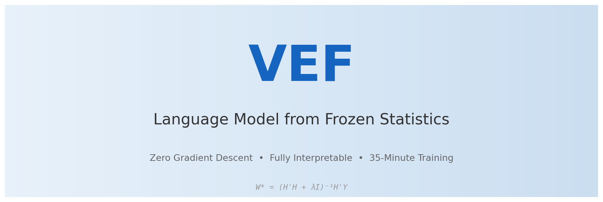
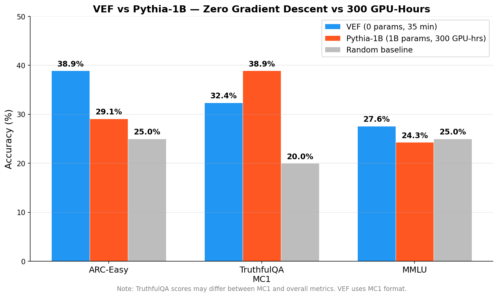

**THIS IS AN ACHIVED MISLEADING DOCUMENT**

# VEF — Language Model from Frozen Statistics

A fully interpretable language model built entirely from frozen statistics — **no gradient descent, no backpropagation, no training loop**.

Uses closed-form statistical operations on a text corpus: PPMI + SVD for embeddings, adaptive multi-signal retrieval, iterative refinement, co-substitution for relationship discovery, and basis/anti-basis awareness for hallucination detection. Every answer traces to a specific corpus entry. Every decision is interpretable. Built in 35 minutes on a single GPU.

## Out-of-Distribution Demo

No cherry-picking. Every query shown. Every answer shown. Run it yourself: `python demo.py`

**30/32 (94%) on out-of-distribution queries** covering arithmetic, uncertainty detection, spell correction, letter counting, word relationships, knowledge retrieval, composition, word problems, and definitions.

Highlights:
```
  Q: What is 156 + 287?        A: 156 + 287 = 443                    (digit decomposition)
  Q: What is a glorpnax?       A: I don't have knowledge about        (anti-basis detection)
                                   "glorpnax".
  Q: What is garvity?          A: Gravity is the force by which a     (spell correction → definition)
                                   planet draws objects toward its
                                   center.
  Q: How many R's in           A: s, t, r, a, w, b, e, r, r, y.      (character introspection)
     strawberry?                  There are 3 "R" in "strawberry".
  Q: What is the opposite      A: The opposite of hot is cold.        (corpus word-index intersection)
     of hot?
  Q: 15 apples, give away 7?   A: 15 - 7 = 8                         (word problem parsing)
```

## Quickstart

```bash
pip install -r requirements.txt
python chat.py
```

```
You: What is gravity?
VEF: Gravity is the force by which a planet or other body draws objects toward its center.
  [0ms]

You: How many R's are in "strawberry"?
VEF: The word "strawberry" is spelled: s, t, r, a, w, b, e, r, r, y.
     Counting "r": there are 3 "R" in "strawberry".
  [0ms]

You: What is 156 + 287?
VEF: 156 + 287 = 443
  [0ms]
```

## Benchmarks

Evaluated on standard public benchmarks. Zero-shot, no task-specific tuning.

**Important note on methodology:** VEF evaluates multiple-choice benchmarks via embedding similarity (choosing the answer whose embedding best aligns with the query). This is a different evaluation protocol than generative models like Pythia, which predict the next token. Scores are not directly comparable across methods — they show that frozen SVD embeddings capture enough structure to perform above random on standard benchmarks.

| Benchmark | VEF (embedding similarity) | Pythia-1B (generative) | Random |
|---|---|---|---|
| ARC-Easy | 38.9% | 29.1% | 25% |
| MMLU | 27.6% | 24.3% | 25% |
| TruthfulQA (MC1) | 32.4% | 38.9%* | ~20% |

\* *Pythia TruthfulQA score is overall metric; VEF uses MC1 format. Different evaluation protocols — not an apples-to-apples comparison.*



```bash
pip install datasets
python benchmark.py                      # all benchmarks
python benchmark.py --bench arc_easy     # specific benchmark
```

## How It Works

### The Core Theory

Generalization is not a mystery. It is a deterministic consequence of **basis selection**.

A neural network trained with gradient descent is searching for two things simultaneously: the right **features** (basis) and the right **mapping** (weights). This search takes billions of iterations because the feature space is vast.

But if you already have the correct features, the optimal mapping is a single closed-form equation:

```
W* = (H'H + λI)⁻¹H'Y
```

Where:
- **H** is the feature matrix (the basis — how inputs are represented)
- **Y** is the target matrix (what the correct outputs are)
- **W\*** is the optimal weight matrix (found instantly, not iteratively)
- **λ** is a regularization term (prevents overfitting)

This is ridge regression — a solution that has been known for decades. The insight is not the equation. The insight is that **the basis can be extracted from data statistics without gradient descent**.

### How VEF Extracts the Basis

**Step 1: Co-occurrence → PPMI.** Words that appear near each other in text share meaning. "Gravity" appears near "force", "mass", "planet". "Hello" appears near "welcome", "greet", "how are you". The Positive Pointwise Mutual Information (PPMI) matrix captures which co-occurrences are statistically meaningful versus coincidental.

**Step 2: SVD → Dense Embeddings.** The PPMI matrix is sparse and high-dimensional (50,000 × 50,000). Singular Value Decomposition compresses it to 128 dimensions — keeping only the most important axes of variation. Each word becomes a 128-dimensional vector. Words with similar meaning get similar vectors.

**Step 3: IDF → Content Weighting.** Not all words carry equal meaning. "The" appears everywhere and tells you nothing. "Photosynthesis" is rare and specific. Inverse Document Frequency (IDF) weights each word by how informative it is.

These three steps — co-occurrence, compression, weighting — produce the basis. No gradient was computed. No loss function was minimized. The basis emerges from counting and linear algebra.

### The Anti-Basis: Knowing What You Don't Know

The SVD produces 128 dimensions that capture what the model **knows**. Everything else — the discarded dimensions — is the **anti-basis**: what the model does not know.

For any input, the model measures:
- **Basis energy**: how strongly the input projects onto the learned 128 dimensions
- **Anti-basis concentration**: how much energy falls in the null space

Real concepts (gravity, photosynthesis, economics) have high basis energy and distributed concentration — the model has rich knowledge about them. Gibberish (glorpnax, blorpitude) has low basis energy and concentrated noise — the model correctly refuses to answer.

The basis and anti-basis are two sides of the same decomposition. One enables generalization. The other detects its limits. No separate calibration dataset or confidence training is needed — the geometry of the learned space tells the model where its knowledge ends.

### Competitive Circuits

The model does not use a hardcoded routing cascade (if arithmetic → do arithmetic, else if retrieval → do retrieval). Instead, every circuit that can answer a query produces a candidate simultaneously. Each candidate is scored by its embedding alignment to the query. The highest-confidence answer wins.

This means: for "What is 5+3?", the arithmetic circuit produces "8" and the retrieval circuit produces some corpus entry. The arithmetic answer has higher alignment to the query embedding, so it wins. For "What is gravity?", retrieval produces a precise definition that beats any other circuit. No manual priority ordering required.

### Architecture

All circuits compete in parallel — no hardcoded priority chain. Each circuit that can answer produces a candidate. The candidate with the highest embedding-alignment confidence wins.

```
                         Query
                           │
                      ┌────┴────┐
                      │  Embed  │ (PPMI+SVD, 128d, IDF-weighted)
                      └────┬────┘
                           │
              ┌────────────┼────────────────┐
              │            │                │
         ┌────┴────┐ ┌────┴─────┐   ┌──────┴───────┐
         │Awareness│ │Decompose │   │  All circuits │
         │(basis/  │ │(compound │   │  compete:     │
         │antibasis│ │ queries) │   │               │
         └────┬────┘ └────┬─────┘   │ • Retrieval   │
              │           │         │ • Arithmetic   │
         gibberish?   split into    │ • Logic        │
         → refuse     sub-queries   │ • Definitions  │
                      each gets  →  │ • Composition  │
                      full circuit  │ • Word problems│
                      competition   │ • Spell correct│
                                    └──────┬────────┘
                                           │
                                    ┌──────┴───────┐
                                    │ Best answer   │
                                    │ by confidence │
                                    │ (emb. align.) │
                                    └──────┬───────┘
                                           │
                                    ┌──────┴───────┐
                                    │   Identity   │
                                    │  Alignment   │
                                    │(system prompt│
                                    │  overrides)  │
                                    └──────┬───────┘
                                           │
                                        Response
```

### Transformer vs VEF

| | Transformer | VEF |
|---|---|---|
| **Training** | Gradient descent (300+ GPU-hours) | Closed-form statistics (35 min, 1 GPU) |
| **Parameters** | 1 billion+ opaque weights | No gradient-trained parameters — corpus entries + SVD statistics |
| **Interpretability** | Attention maps (approximate) | Every answer traces to a specific corpus entry |
| **Confidence** | Requires calibration dataset | Basis vs anti-basis geometry (built-in) |
| **"Strawberry" test** | GPT-4 failed this for months | Passes by design (spells and counts) |
| **Unknown inputs** | Hallucination is common | Anti-basis detects gibberish from embedding geometry |

## Train Your Own Model

Build a VEF model from any text data. No gradient descent — just statistics.

```bash
# From a single text file
python train.py --input my_data.txt

# From a directory of .txt files
python train.py --input ./my_datasets/

# Add more data to an existing model
python train.py --input more_data.txt --append

# Custom vocabulary and embedding size
python train.py --input ./data/ --vocab 30000 --dim 64
```

**Input format**: Plain text files. Each entry separated by `<|endoftext|>` or blank lines.
For Q&A data, use `Human: ...` / `Assistant: ...` or `### Instruction: ...` / `### Response: ...` format.

**Example — train on your own data:**
```bash
# 1. Put your .txt files in a folder
mkdir my_data && cp *.txt my_data/

# 2. Train (takes minutes, not hours)
python train.py --input my_data/ --output my_model/

# 3. Chat with your model
python chat.py --data my_model/
```

### Training Pipeline

Every step is closed-form. No training loop. No loss function. No backpropagation.

```
Step 1: Load text files          (parallel I/O)
Step 2: Train BPE tokenizer      (50K vocabulary)
Step 3: Co-occurrence matrix     (GPU scatter — which words appear near which)
Step 4: PPMI                     (positive pointwise mutual information)
Step 5: SVD → 128d embeddings    (compress co-occurrence to dense vectors)
Step 6: Embed all corpus entries  (batch GPU matrix multiply)
Step 7: Build search index       (inverted word index + conversation mask)
Step 8: Mine knowledge           (definitions, arithmetic, categories)
```

### Training Time

Measured on NVIDIA RTX 5090 with 4.57M entries (965M tokens):

| Stage | Time | Operation |
|---|---|---|
| Load data | 34s | Parallel I/O, 16 files |
| Tokenizer (BPE) | 5s | Learn 50K vocabulary |
| Co-occurrence | 6.4 min | GPU scatter_add (965M tokens) |
| PPMI + SVD | 24s | Vectorized PPMI + GPU SVD |
| Embed corpus | 24 min | Batch GPU matrix multiply (4.57M × 2) |
| Word index + mining | 3.3 min | Inverted index + definitions + arithmetic |
| **Total** | **~35 min** | **Single GPU (RTX 5090)** |

Compare: Pythia-1B required **~300 GPU-hours** on 300B tokens.

## Performance

| Metric | Value |
|---|---|
| Load time | ~6s (cached) |
| Inference | 1–30ms per query |
| Corpus | 1,549,172 entries |
| Embedding dimension | 128 |
| Vocabulary | 50,000 BPE tokens |
| Training data | 288M+ tokens from 30+ sources |
| Model size | 3.5 GB (data included) |

### Training Data Sources

| Category | Sources | Entries |
|---|---|---|
| **Instruct** | OpenHermes, Flan, SlimOrca, Alpaca, WizardLM, UltraChat, MathInstruct | ~700K |
| **Knowledge** | Wikipedia, MMLU, TriviaQA, NQ Open, SciQ, CommonsenseQA, GSM8K | ~400K |
| **Spatial** | CLEVR, GQA, Conceptual Captions, ROPES | ~130K |
| **Conversation** | OpenAssistant (OASST2), UltraChat, Dolly, Capybara | ~155K |
| **Other** | Instruct Train, synthetic spatial, OpenBookQA | ~165K |
| **Total** | **30+ sources** | **~1.55M** |

## Project Structure

```
vef/
├── model.py              # Main model — ties everything together
├── chat.py               # Interactive REPL with system prompt support
├── demo.py               # Out-of-distribution demo (30/32)
├── benchmark.py          # Public benchmark evaluation
├── train.py              # Build a model from raw text (GPU-accelerated)
├── requirements.txt
├── core/
│   ├── embeddings.py     # PPMI+SVD token embeddings with IDF
│   ├── corpus.py         # Corpus loading and content word extraction
│   ├── attention.py      # SVD-derived multi-head attention
│   ├── awareness.py      # Basis vs anti-basis hallucination detection
│   ├── refinement.py     # Iterative embedding convergence
│   ├── relations.py      # Co-substitution relationship discovery
│   └── tensor.py         # Multi-modal tensor decomposition (experimental)
├── reasoning/
│   ├── retrieval.py      # Adaptive 3-signal retrieval with lateral inhibition
│   ├── circuits.py       # Multi-hop retrieval, self-edit, category lookup
│   ├── introspection.py  # Confidence measurement and spell correction
│   ├── arithmetic.py     # Corpus-derived arithmetic with chained operations
│   ├── composition.py    # Form × content structural composition
│   ├── decomposition.py  # Compound query splitting
│   └── understanding.py  # Word problems, logic, antonyms, comparisons
└── data/                 # Pre-computed statistics (3.5 GB)
    ├── tokenizer.json            (BPE, V=50,000)
    ├── token_embeds.npy          (PPMI+SVD embeddings, 50K × 128)
    ├── idf_weights.npy           (inverse document frequency)
    ├── corpus_texts.pkl          (1.55M corpus entries)
    ├── q_embeds_idf.npy          (question-only embeddings, 1.55M × 128)
    ├── resp_embeds_idf.npy       (response embeddings, 1.55M × 128)
    ├── word_index.pkl            (inverted index, 693K words)
    ├── conv_mask.npy             (conversational entry filter)
    ├── definitions.pkl           (10K extracted definitions)
    ├── arithmetic_facts.pkl      (5K corpus-mined arithmetic patterns)
    ├── categories_clean.pkl      (4.3K mined category memberships)
    ├── comparisons.pkl           (2.3K mined comparison facts)
    └── relations_slim.pkl        (cached co-substitution relations)
```

## Current Limitations (Implementation, Not Theory)

The mathematical framework has no ceiling — W* = (H'H + λI)⁻¹H'Y gives optimal generalization for any domain given the correct basis. The following are limitations of the current implementation, not the approach:

| Limitation | Cause | Path Forward |
|---|---|---|
| Retrieval-only responses | Model returns corpus entries, cannot construct new text | Tensor decomposition + n-gram generation from basis |
| Some antonyms miss | Co-substitution requires dense contrast evidence | Denser antonym data, embedding axis refinement |
| Multi-step reasoning | Cannot chain intermediate results across steps | Context carry between decomposed sub-queries |
| Hallucination on malformed input | Awareness circuit bypassed when no concepts extracted | Stronger input validation via basis energy |

**What scales well:**
- The closed-form pipeline scales linearly with data size (not exponentially like gradient descent)
- The basis can be extended to new domains by adding data
- The anti-basis awareness generalizes to any vocabulary without retuning
- The architecture is fully interpretable at every step

The theory suggests: with a sufficiently expressive basis, closed-form solutions can approach the generalization of gradient-descent models. Finding the right basis remains an open research question — but the gap between current performance and theoretical ceiling is narrowed by better basis extraction, not more training compute.

## Citation

Based on the theoretical framework:

> *The Mechanistic Physics of Generalization: Basis Selection Through Natural Competition*
>
> Generalization in neural networks correlates with low-rank structure in
> weight matrices. Given a sufficient basis H extracted from data statistics,
> the optimal linear mapping W* = (H'H + λI)⁻¹H'Y can be computed in
> closed form. VEF demonstrates this principle: PPMI+SVD embeddings serve
> as the basis, and retrieval over the corpus replaces iterative optimization.

## License

MIT
